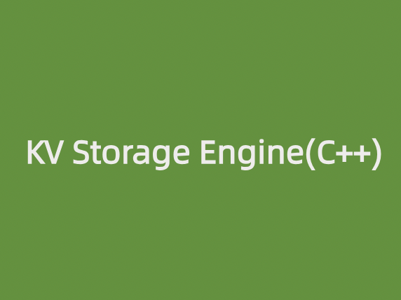

\

## About KV Storage Engine
A mini levelDB. \
The storage engine is small and refined, purely focused on stand-alone read/write/storage (responsible for disk write/read operations, usually using some kind of data structure to implement indexing, the more common ones are B-tree and LSM tree, this project uses LSM Tree). Generally speaking, the bottom layer of the database often uses some kind of storage engine.\
The following figure is the structure of the LSM tree.\

## Design highlights：
- Developed an LSM-based KV storage engine with rapid data insertion, efficient retrieval, and robust support for data persistence and crash recovery.
- Adopted in-memory skip lists with multi-tiered SSTable design, reducing data redundancy and optimizing storage efficiency and query performance.
- Integrated data compression techniques in SSTable files, boosting storage space utilization and implemented Bloom indexes, thus enhancing query efficiency.
- Utilized WAL logging to ensure swift system recovery and enhanc

